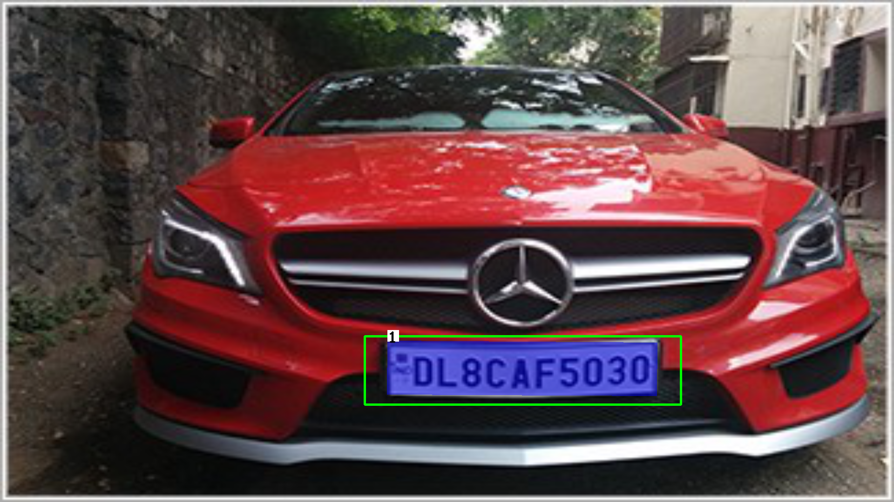

# Indian ANPR
  

Detection and recognition of indian license number plate implemented in Pytorch. Classifies number plate into 10 classes as {auto front,auto back, car front, car back, bus back, bus front, truck back, truck front, bike back, bike front}

Trained on custom HRNet ([Link](https://arxiv.org/abs/1904.04514)) model for detection and segmentation of the plate and used LPRNet ([Link](https://arxiv.org/abs/1806.10447)) for recognition of license plate.


## Steps to run 
 1. Clone this repository
 ```
 git clone https://github.com/Garvit-32/ANPR-for-Indian-Plates.git
``` 
 2. Install all the dependencies
```
pip install -r requirements.txt 
```
3.  Run inference 
```
python main.py --image <path to image> --seg_weights <path to HRNet weights> --lpr_weights <path to LPRNet weights>
```

Example
```
python main.py --image demo_images/test2.jpeg --seg_weights weights/hrnetv2_hrnet_plate_199.pth --lpr_weights weights/iter2.pth
```


## DEMO  
    
### Input  

    
  

## Output  
  

  
  