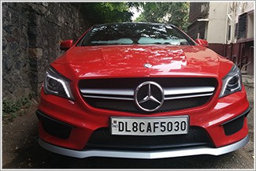

# Indian ANPR
  

Detection and recognition of indian license number plate implemented in Pytorch. Classifies number plate into 10 classes as {auto front,auto back, car front, car back, bus back, bus front, truck back, truck front, bike back, bike front}

Trained on custom HRNet ([Link](https://arxiv.org/abs/1904.04514)) model for detection and segmentation of the plate and used LPRNet ([Link](https://arxiv.org/abs/1806.10447)) for recognition of license plate.

## DEMO  
    

### Input  

    
  

## Output  
  

  
  
